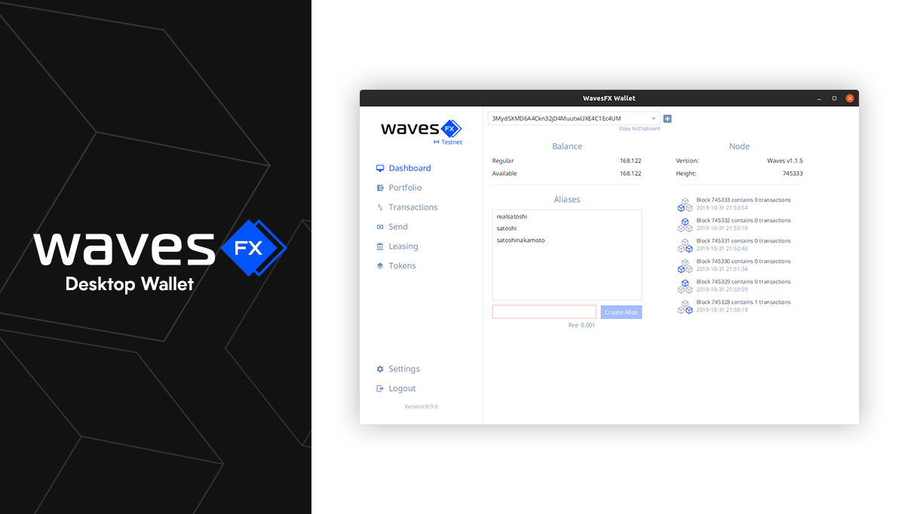

# WavesFX



WavesFX is an open-source [Waves](https://wavesplatform.com) wallet for Windows, macOS and Linux.

Releases can be found on the [release](https://github.com/wavesfx/wavesfx/releases) list.


# How to build WavesFX

## 1. Prerequisites

### Install Java Development Kit (JDK) 14

[OpenJDK](https://jdk.java.net/14/) and [AdoptOpenJDK](https://adoptopenjdk.net/archive.html) are excellent choices. 

## 2. Obtain Source Code

```
git clone github.com/wavesfx/wavesfx
cd wavesfx
```
## 3. Compilation and packaging
### Build binary package
```
./gradlew jpackageImage 
```
Package will be located in `build/jpackage`   
### Build installer
**Note:** Wix, a third-party tool, is required to generate an installer for Windows.
```
./gradlew jpackage
```
# Bug Reports
Please use the issue tracker provided by GitHub to send bug reports or feature requests.